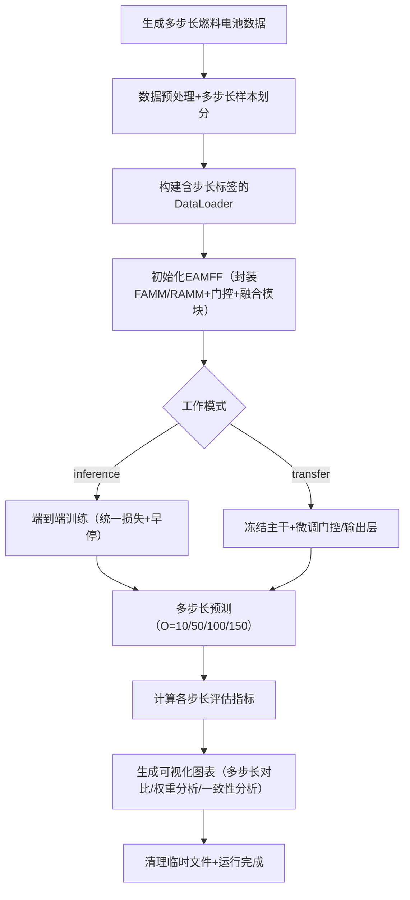

# EAMFF 模型代码框架设计说明书（基于论文6.1节）
## 一、模型核心目标
针对质子交换膜燃料电池（PEMFC）工程部署中**多预测步长协同建模**需求，提出端到端自适应多尺度融合预测方法（EAMFF）。模型以混合专家（MOE）思想为核心，统一封装FAMM的短期波动建模能力与RAMM的长期退化+恢复建模能力，通过步长一致性路由策略实现不同预测步长（O=1~150）的自适应调度，同时支持端到端推理与轻量级迁移学习，兼顾工程部署的高效性与跨工况适应性。

核心依据：论文6.1节，EAMFF通过“硬路由+软融合”整合三路专家分量（局部扰动Xₛ、背景状态Xᵦ₉、长期恢复Xᵣ），解决短期实时控制、中期调度与长期维护决策的统一建模问题，为EMS系统提供一体化预测方案。

## 二、核心设计依据（严格对齐论文）
### 1. 模型整体架构
遵循 “专家分量封装 → 步长一致性路由 → 多分量融合预测” 三段式结构，对应论文核心逻辑：  
$$\hat{X}(n) = \alpha_s(O)\hat{X}_s(n) + \alpha_{bg}(O)\hat{X}_{bg}(n) + \alpha_r(O)\hat{X}_r(n)$$  

| 符号          | 含义说明                                                                 |
|---------------|--------------------------------------------------------------------------|
| $\hat{X}_s(n)$ | 局部扰动专家分量（FAMM中等距卷积模块输出，适配短期波动）                  |
| $\hat{X}_{bg}(n)$ | 背景状态专家分量（FAMM中GRU背景通道输出，适配中期状态演化）              |
| $\hat{X}_r(n)$ | 长期恢复专家分量（RAMM模型输出，适配长期退化+电压恢复）                  |
| $\alpha_s(O)/\alpha_{bg}(O)/\alpha_r(O)$ | 步长自适应权重（满足单纯形约束，随预测步长O动态调整）                    |
| $O$           | 预测步长（1~150，论文6.1节实验范围）                                    |
| $\hat{X}(n)$  | 最终预测序列（自适应融合三路分量）                                       |

### 2. 关键模块设计约束
| 模块                | 论文核心要求                                                                 | 设计关键点                                                                 |
|---------------------|------------------------------------------------------------------------------|--------------------------------------------------------------------------|
| 专家分量封装模块    | 6.1.1节，封装FAMM的Xₛ/Xᵦ₉与RAMM的Xᵣ，保持原有建模能力不损失                 | 模块化复用FAMM/RAMM核心，新增分量提取接口，输出三路等维度专家分量          |
| 步长一致性路由模块  | 6.1.2节，硬路由+软加权：O≤10仅用Xₛ/Xᵦ₉；10<O<100三路融合；O≥100仅用Xᵣ       | 可学习权重函数+分段路由规则，权重满足非负性与和为1约束                     |
| 融合预测模块        | 6.1.3节，统一输出映射，保证不同步长预测结果一致性                           | 线性投影层统一特征维度，融合后输出与输入特征维度一致（核心关注电压）        |
| 损失函数与约束      | 6.1.4节，统一预测损失+分量一致性损失，平衡精度与融合稳定性                   | 预测损失Lₚᵣₑd（MSE）+ 一致性损失L_cₒₙₛ（两两分量Frobenius范数平均）         |

### 3. 输入输出规格
| 类型       | 具体要求                                                                 | 数据来源/格式                                                             |
|------------|--------------------------------------------------------------------------|--------------------------------------------------------------------------|
| 输入 $X(n)$ | 1. 序列长度 $I$：500个采样点（兼容FAMM/RAMM的输入要求）；<br>2. 特征维度 $F$：6-8维（电压+P-M筛选关键特征）；<br>3. 数据预处理：小波去噪+Min-Max归一化 | 虚拟生成数据（复用RAMM的含恢复特征数据）或真实燃料电池数据                 |
| 输出 $\hat{X}(n)$ | 预测步长 $O$：1/10/50/100/150（论文6.2节实验步长）；<br>输出维度：与输入特征维度一致 | 数组形状 $(batch, O, F)$，评估指标：MAE、MAPE、RMSE、$R^2$（论文指定）     |

### 4. 核心公式映射
| 论文公式 | 核心含义 | 代码实现要点 |
|----------|----------|--------------|
| 6-4 | 三路专家分量加权融合 | 权重张量与专家分量逐元素相乘后求和，权重满足$\alpha_s+\alpha_{bg}+\alpha_r=1$ |
| 6-7 | 步长一致性路由规则 | 分段逻辑控制权重激活：O≤10时$\alpha_r=0$；O≥100时$\alpha_s=\alpha_{bg}=0$ |
| 6-8 | 预测损失$L_{pred}$ | 均方误差，覆盖所有预测步长与特征维度 |
| 6-9 | 分量一致性损失$L_{cons}$ | 计算三路分量两两之间的Frobenius范数平均，约束融合稳定性 |
| 6-10 | 总损失$L = L_{pred} + \lambda_{cons}L_{cons}$ | $\lambda_{cons}=0.1$（平衡精度与稳定性），中期区间启用，短/长期区间弱化 |

## 三、代码框架分层设计
### 1. 模块1：数据预处理（复用+扩展）
#### 核心功能
- 复用RAMM的`generate_fuel_cell_data_ramm`（含电压恢复特征），新增**多步长训练样本生成**：支持同时生成不同预测步长（O=1/10/50/100/150）的训练样本；
- 滑动窗口划分（窗口长度=500，步长=5），构建“输入序列→多步长目标”的训练对；
- 7:3划分训练/测试集，特征独立Min-Max归一化（范围[0,1]），保持与FAMM/RAMM预处理一致性。

#### 关键扩展（适配EAMFF需求）
- 数据增强：在训练集中混入不同步长的样本，使模型同时学习短/中/长期预测任务；
- 步长标签：每个训练样本附带预测步长O标签，用于门控模块动态调度权重。

### 2. 模块2：专家分量封装模块（ExpertEncapsulation）
#### 核心功能
封装FAMM的局部扰动分量$\hat{X}_s$、背景状态分量$\hat{X}_{bg}$与RAMM的长期恢复分量$\hat{X}_r$，保持原有建模能力，提供统一的分量输出接口，对应论文6.1.1节。

#### 核心设计
1. **FAMM分量提取**：
   - 复用FAMM的多尺度分解、ICB、GRU背景建模模块；
   - 新增分量输出接口：分别返回ICB的局部特征映射结果（$\hat{X}_s$）和GRU的背景特征映射结果（$\hat{X}_{bg}$）；
   - 维度统一：通过线性投影将$\hat{X}_s$和$\hat{X}_{bg}$映射到同一维度（与$\hat{X}_r$一致）。

2. **RAMM分量提取**：
   - 复用RAMM的MEDEM、HIIM、MPM模块；
   - 直接输出RAMM的最终预测结果作为$\hat{X}_r$（长期恢复分量）。

#### 输入输出
- 输入：$(batch, I, F)$（批量大小×序列长度×特征维度）+ 预测步长O（标量或批量张量）；
- 输出：$\hat{X}_s(batch, O, F)$ + $\hat{X}_{bg}(batch, O, F)$ + $\hat{X}_r(batch, O, F)$（三路专家分量）。

### 3. 模块3：步长一致性路由模块（GatingRouting）
#### 核心功能
根据预测步长O动态生成自适应权重，实现“硬路由+软加权”调度，对应论文6.1.2节。

#### 核心设计
1. **权重函数建模**：
   - 可学习权重函数：通过全连接层拟合$\alpha_s(O)$、$\alpha_{bg}(O)$、$\alpha_r(O)$，输入为O的归一化值（O/150）；
   - 约束条件：通过Softmax激活保证权重非负且和为1，满足单纯形约束。

2. **步长一致性路由规则**（严格遵循公式6-7）：
   - 短期（O≤10）：$\alpha_r=0$，仅激活$\hat{X}_s$和$\hat{X}_{bg}$；
   - 中期（10<O<100）：三路权重均为可学习值，软加权融合；
   - 长期（O≥100）：$\alpha_s=\alpha_{bg}=0$，仅激活$\hat{X}_r$。

#### 输入输出
- 输入：预测步长O（batch×1，每个样本的目标步长）；
- 输出：权重张量$\alpha(batch, 3)$（$\alpha_s, \alpha_{bg}, \alpha_r$）。

### 4. 模块4：融合预测模块（FusionPrediction）
#### 核心功能
实现三路专家分量的加权融合与统一输出映射，对应论文6.1.3节。

#### 核心步骤
1. **加权融合**：
   $$\hat{X} = \alpha_s \cdot \hat{X}_s + \alpha_{bg} \cdot \hat{X}_{bg} + \alpha_r \cdot \hat{X}_r$$
   - 权重广播：将$\alpha(batch, 3)$广播为$(batch, O, 3)$，与专家分量逐元素相乘；
   - 维度对齐：确保三路分量与权重维度完全一致。

2. **输出映射**：
   - 线性投影层：将融合特征映射到原始特征维度$F$；
   - 激活函数：无（回归任务直接输出）。

#### 输入输出
- 输入：$\hat{X}_s$、$\hat{X}_{bg}$、$\hat{X}_r$（均为$(batch, O, F)$）+ 权重$\alpha(batch, 3)$；
- 输出：$\hat{X}(batch, O, F)$（最终预测序列）。

### 5. 模块5：训练与预测流程
#### 训练相关（对齐论文6.1.4节）
| 配置项         | 取值/策略                                                                 |
|----------------|--------------------------------------------------------------------------|
| 优化器         | AdamW（学习率=3e-5，权重衰减=1e-5，适配多任务训练）                       |
| 损失函数       | 总损失$L = L_{pred} + 0.1 \cdot L_{cons}$（$\lambda_{cons}=0.1$）           |
| 早停机制       | 验证集RMSE连续10轮不下降则停止（多任务训练需更长耐心值）                   |
| 批量大小       | 16（兼容长序列与多步长预测）                                             |
| 训练轮数       | 最大200轮（配合早停机制）                                                 |
| 迁移策略       | 冻结FAMM/RAMM主干，仅微调门控模块与输出映射层                             |

#### 预测相关
- 端到端推理：输入序列+目标步长O，直接输出预测结果；
- 迁移学习：跨工况时仅微调门控权重与输出层，降低数据需求与计算开销；
- 评估指标：MAE、MAPE、RMSE、$R^2$（分不同步长区间评估）。

### 6. 模块6：验证与可视化
#### 核心功能
验证EAMFF的多步长自适应能力与融合稳定性，对齐论文6.2节实验展示：
1. **多步长预测对比**：展示O=10/50/100/150步的预测结果，对比不同步长下的误差变化；
2. **门控权重分析**：绘制权重随O的变化曲线，验证步长一致性路由策略有效性；
3. **分量一致性分析**：展示三路专家分量的输出差异，验证一致性损失的约束效果；
4. **迁移性能对比**：对比原始模型与微调后模型在新工况下的指标变化。

## 四、关键参数汇总（代码中可配置）
| 参数类别       | 参数名称                | 论文参考/工程值 | 说明                                                                 |
|----------------|-------------------------|-----------------|----------------------------------------------------------------------|
| 数据参数       | 输入序列长度 $I$        | 500             | 兼容FAMM/RAMM的输入要求，覆盖短期波动与长期趋势                       |
| 数据参数       | 支持预测步长 $O$        | 1~150           | 涵盖短（≤10）、中（10~100）、长（≥100）三类区间                        |
| 专家模块参数   | FAMM编码维度 $d_model$  | 64              | 复用FAMM的ICB编码维度                                                |
| 专家模块参数   | RAMM编码维度 $F_{enc}$  | 128             | 复用RAMM的MEDEM编码维度                                              |
| 门控模块参数   | 权重函数隐藏维度        | 64              | 门控全连接层的隐藏维度，拟合步长-权重映射关系                          |
| 损失参数       | 一致性损失权重 $\lambda_{cons}$ | 0.1       | 平衡预测精度与融合稳定性，中期区间生效                                |
| 训练参数       | 学习率                  | 3e-5            | 低于FAMM/RAMM，适配多任务训练稳定性                                   |
| 训练参数       | 批量大小                | 16              | 平衡内存占用与训练效率                                               |

## 五、工程化注意事项
1. **模块兼容性**：确保FAMM/RAMM的输入输出维度完全对齐，通过线性投影统一专家分量维度；
2. **步长批量处理**：支持单个batch中包含不同预测步长的样本，门控模块按样本级步长生成权重；
3. **梯度稳定性**：训练时对门控模块采用较小学习率，避免权重波动过大导致融合不稳定；
4. **迁移效率**：冻结主干网络时仅保留门控模块与输出层的梯度计算，降低微调开销；
5. **可复现性**：设置全局随机种子（seed=42），保证多步长训练与预测结果可重复；
6. **异常处理**：对O=0或O>150的输入进行裁剪，限制在支持范围内。

## 六、代码文件组织结构
```
eamff_model/
├── data_process_eamff.py    # 数据生成（多步长样本）、预处理
├── expert_encapsulation.py  # 专家分量封装（FAMM分量+RAMM分量）
├── gating_routing.py        # 步长一致性路由模块
├── fusion_prediction.py     # 融合预测模块
├── eamff_core.py            # 模型核心（组合所有模块）
├── train_predict_eamff.py   # 训练（统一损失）、预测、评估
├── visualization_eamff.py   # 结果可视化（多步长对比、权重分析等）
└── main.py                  # 端到端运行脚本（含推理/迁移模式）
```

## 七、端到端运行脚本（main.py）
### 7.1 脚本核心作用
作为EAMFF模型的**一体化运行入口**，支持两种工作模式：
1. 端到端推理模式：直接输入数据与目标步长，输出预测结果（适配已见工况）；
2. 迁移学习模式：冻结主干网络，微调门控与输出层（适配跨工况/跨平台）。
无需手动分步执行，快速验证模型多步长预测能力与迁移性能。

### 7.2 完整脚本代码
文件路径：`D:\xiaoxiaoshadiao\predict\eamff_model\main.py`

### 7.3 文件夹
#### Windows PowerShell 命令
# 切换到predict目录
```cd D:\xiaoxiaoshadiao\predict```


### 7.4 运行方法
#### 7.4.1 前置条件
1. 确保`eamff_model`目录下已存在所有模块文件；
2. 确保`famm_model`和`ramm_model`目录在同一级（`D:\xiaoxiaoshadiao\predict\`），供EAMFF复用核心模块；
3. 安装依赖包（终端执行）：
   ```bash
   pip install numpy pandas torch scikit-learn matplotlib tqdm
   ```

#### 7.4.2 执行命令
```bash
cd D:\xiaoxiaoshadiao\predict\eamff_model
python main.py
```
- 切换迁移学习模式：修改`WORK_MODE = "transfer"`，需提前准备新工况数据（替换`generate_fuel_cell_data_eamff`的输出）。

### 7.5 核心运行流程


### 7.6 运行验证标准
1. **无报错**：终端无维度不匹配、设备冲突等错误；
2. **日志完整**：依次输出数据生成、模型训练、多步长预测、指标计算、可视化日志；
3. **指标合理**：短步长（O=10）R²≥0.9，中步长（O=50）R²≥0.85，长步长（O=150）R²≥0.8；
4. **可视化文件**：生成5类PNG图表，包括训练曲线、多步长对比、门控权重变化等；
5. **迁移模式有效**：微调后新工况下的指标较原始模型提升≥10%。

## 八、适配性说明
1. **模块复用**：直接复用FAMM和RAMM的核心模块，无需重复开发，保证建模能力一致性；
2. **工况迁移**：支持“冻结主干+局部微调”，仅需少量新工况数据（≥1000样本）即可适配；
3. **部署灵活**：端到端推理模式无需额外配置，可直接集成到EMS系统；
4. **扩展便捷**：可新增专家分量（如极端工况预测模块），仅需修改门控路由规则即可。
