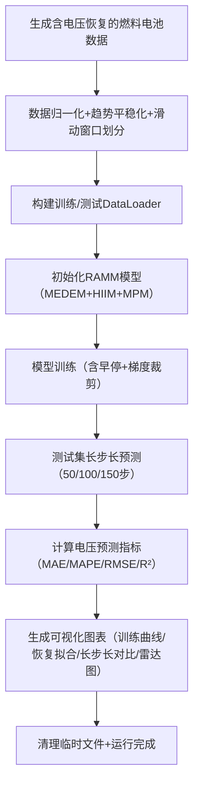

# RAMM 模型代码框架设计说明书（基于论文5.1节）
## 一、模型核心目标
针对质子交换膜燃料电池（PEMFC）长期运行中的**电压恢复行为与非线性退化趋势耦合建模**问题，实现长步长（50-150步）高精度预测。模型需同时刻画两类关键特性：一是膜衰减、催化剂老化主导的**不可逆长期退化趋势**；二是启停循环、水分再分布引发的**可逆电压恢复行为**，为燃料电池长期健康管理与维护决策提供理论支撑。

核心依据：论文5.1-5.2节，模型输入为小波去噪后的电压序列+P-M分数法筛选后的特征，输出为未来长步长的电压预测值，重点解决“可恢复扰动”与“不可逆老化”的耦合建模问题。

## 二、核心设计依据（严格对齐论文）
### 1. 模型整体架构
遵循 “多尺度指数分解编码 → 历史信息整合 → 融合预测” 三段式结构，对应论文核心逻辑：  
$$\hat{X}(n) = MPM(X_E^1, X_E^2) = f_{RAMM}(X(n))$$  

| 符号          | 含义说明                                                                 |
|---------------|--------------------------------------------------------------------------|
| $X(n)$        | 输入序列（含电压及P-M筛选后的特征，如电流、极板温度等，共6-8维）          |
| $X_E$         | 指数分解后的多尺度子序列（$X_0,X_1,...,X_M$，长度依次减半）                |
| $X_E^0$       | 编码后的多尺度子序列（含数值编码VE+位置编码PE）                            |
| $X_E^1/X_E^2$ | 历史信息整合后的特征序列（两层HIIM处理）                                  |
| $\hat{X}(n)$  | 最终预测序列（多尺度预测结果加和融合）                                     |

### 2. 关键模块设计约束
| 模块                | 论文核心要求                                                                 | 设计关键点                                                                 |
|---------------------|------------------------------------------------------------------------------|--------------------------------------------------------------------------|
| 多尺度指数分解编码（MEDEM） | 5.1.1节，指数尺度划分（长度依次减半），分离低频趋势与高频恢复扰动，双重编码保留幅值+位置信息 | 指数下采样分解为$M+1$个子序列，编码函数$Encoding(\cdot)$含VE+PE，统一特征维度 |
| 历史信息整合（HIIM）       | 5.1.2节，全连接层实现双向更新（趋势自上而下细化+局部自下而上聚合），两层顺序整合 | 稳健分解提取宏观/微观项，TrendLinear/LocalLinear为全连接层，线性一致化融合 |
| 融合预测（MPM）             | 5.1.3节，多尺度预测结果线性投影+加和融合，保证长步长预测一致性               | 各尺度特征经线性投影得到$Y_m$，最终$\hat{X} = \sum_{m=0}^M Y_m$             |

### 3. 输入输出规格
| 类型       | 具体要求                                                                 | 数据来源/格式                                                             |
|------------|--------------------------------------------------------------------------|--------------------------------------------------------------------------|
| 输入 $X(n)$ | 1. 序列长度 $I$：默认500个采样点（覆盖至少2个完整恢复周期）；<br>2. 特征维度 $F$：6-8维（电压+P-M筛选关键特征）；<br>3. 数据预处理：小波去噪（论文3.2.2节）+ 趋势平稳化 | 虚拟生成数据（延续`generate_fuel_cell_data`，新增电压恢复特征）             |
| 输出 $\hat{X}(n)$ | 预测步长 $O$：50/100/150步（论文5.2节实验范围）；<br>输出维度：与输入特征维度一致（核心关注电压） | 数组形状 $(O, F)$，评估指标：MAE、MAPE、RMSE、$R^2$（论文5.2节指定）        |

## 三、代码框架分层设计
### 1. 模块1：数据预处理与输入封装（复用+扩展）
#### 核心功能
- 复用`generate_fuel_cell_data`函数，新增**电压恢复特征**：模拟启停后电压先降后升的恢复过程（每100个采样点触发1次恢复，恢复幅度随退化阶段递减）；
- 滑动窗口划分长序列（窗口长度=500），构建训练样本（输入序列→长步长预测目标）；
- 7:3划分训练/测试集，特征独立Min-Max归一化（范围[0,1]）；
- 趋势平稳化：对输入序列做差分处理，增强线性衰退分量的可识别性。

#### 关键扩展（适配RAMM需求）
- 数据增强：在虚拟数据中加入周期性电压恢复（早期恢复幅度0.05V，后期衰减至0.01V）；
- 窗口滑动步长：5个采样点（长序列场景下保证数据量）；
- 输入序列长度：固定为500（兼容指数分解后最小子序列长度≥25）。

### 2. 模块2：多尺度指数分解编码模块（MEDEM）
#### 核心功能
按指数尺度划分输入序列，分离低频趋势与高频恢复扰动，通过双重编码保留幅值与时间位置信息，对应论文5.1.1节。

#### 核心步骤（严格对齐论文公式）
1. **指数下采样分解**（论文公式5-2）：  
   输入序列 $X(n) \in \mathbb{R}^{I \times F}$ 按指数尺度拆分为 $M+1$ 个子序列，长度依次减半：  
   $$X_E = ExpDecomp(X) = [X_0, X_1, ..., X_M]$$  
   - $X_0 = X$（原始长度$I$），$X_m \in \mathbb{R}^{\frac{I}{2^m} \times F}$（$m=1..M$，$M$默认取3，最小子序列长度$\frac{I}{8}=62.5$→向下取整62）；
   - 下采样方式：平均池化（保证趋势平滑，避免信息丢失）。

2. **双重编码**（论文公式5-3）：  
   对每个子序列做数值编码（VE）+ 位置编码（PE），映射到统一高维空间：  
   $$X_E^0 = Encoding(X_E) = [X_0^0, X_1^0, ..., X_M^0]$$  
   - 数值编码（VE）：全连接层线性映射，$X_m^0 \in \mathbb{R}^{\frac{I}{2^m} \times F_{enc}}$（$F_{enc}=128$为编码维度）；
   - 位置编码（PE）：正弦位置编码，保留时间索引信息（长序列建模关键）。

#### 输入输出
- 输入：$(batch, I, F)$（批量大小×序列长度×特征维度）
- 输出：$X_E^0$（列表形式，含$M+1$个张量，每个张量形状为$(batch, \frac{I}{2^m}, F_{enc})$）

### 3. 模块3：历史信息整合模块（HIIM）
#### 核心功能
通过全连接层实现双向跨尺度信息更新，强化趋势长程依赖与局部恢复聚合，对应论文5.1.2节，采用两层顺序整合。

#### 核心步骤（严格对齐论文公式）
1. **稳健分解**（论文公式5-4~5-7）：  
   对每个编码子序列 $X_m^0$ 提取宏观趋势项 $X_{ET}^m$ 与微观恢复项 $X_{EL}^m$：  
   $$X_{ET}^m = mean(AvgPool(Pad(X_m^0), kernel_n))$$  
   $$X_{EL}^m = X_m^0 - X_{ET}^m$$  
   - $kernel_n$ 为多核组合（默认2/4/6，保证趋势与扰动可分）；
   - $Pad(X_m^0)$ 为零填充，保证池化后长度不变。

2. **双向线性更新**（论文公式5-8~5-9）：  
   用全连接层实现跨尺度信息耦合，趋势自上而下细化，局部自下而上聚合：  
   - 趋势项更新（自上而下）：$X_{ET}^m = X_{ET}^m + TrendLinear(X_{ET}^{m+1})$  
     - $TrendLinear$：全连接层，输入维度$(batch, \frac{I}{2^{m+1}}, F_{enc})$，输出维度$(batch, \frac{I}{2^m}, F_{enc})$；
   - 局部项更新（自下而上）：$X_{EL}^m = X_{EL}^m + LocalLinear(X_{EL}^{m-1})$  
     - $LocalLinear$：全连接层，输入维度$(batch, \frac{I}{2^m}, F_{enc})$，输出维度$(batch, \frac{I}{2^{m+1}}, F_{enc})$；
   - 边界处理：$X_{ET}^M$（最粗尺度）无上层趋势，$X_{EL}^0$（最细尺度）无下层局部，仅保留原始值。

3. **线性一致化**（论文公式5-10）：  
   全连接层对齐特征维度，实现信息融合：  
   $$X_m^1 = X_m^0 + Linear(X_{ET}^m + X_{EL}^m)$$  

4. **两层顺序整合**（论文公式5-11~5-12）：  
   重复上述流程，得到第二层整合结果 $X_E^2 = HIIM_2(X_E^1)$，强化跨尺度耦合。

#### 输入输出
- 输入：$X_E^0$（列表形式，含$M+1$个张量）
- 输出：$X_E^1/X_E^2$（列表形式，与$X_E^0$结构一致）

### 4. 模块4：融合预测模块（MPM）
#### 核心功能
将两层历史信息整合后的多尺度特征映射为统一长步长预测结果，对应论文5.1.3节。

#### 核心步骤（严格对齐论文公式）
1. **多尺度线性投影**（论文公式5-13）：  
   对每层整合结果的每个子序列做线性投影，映射到预测维度：  
   $$Y_m^1 = Linear_m(X_m^1), \quad Y_m^2 = Linear_m(X_m^2)$$  
   $$Y_m = Y_m^1 + Y_m^2$$  
   - $Linear_m$：全连接层，输入维度$(batch, \frac{I}{2^m}, F_{enc})$，输出维度$(batch, O, F)$（$O$为预测步长）；
   - 投影后通过插值统一长度（适配预测步长$O$）。

2. **多尺度加和融合**（论文公式5-14）：  
   所有尺度预测结果加和，得到最终预测序列：  
   $$\hat{X} = \sum_{m=0}^M Y_m$$  

#### 输入输出
- 输入：$X_E^1, X_E^2$（两层历史信息整合后的多尺度特征列表）
- 输出：$\hat{X} (batch, O, F)$（长步长预测序列）

### 5. 模块5：训练与预测流程
#### 训练相关（对齐论文5.2节实验设计）
| 配置项         | 取值/策略                                                                 |
|----------------|--------------------------------------------------------------------------|
| 优化器         | AdamW（学习率=5e-5，权重衰减=1e-5，适配长序列训练稳定性）                 |
| 损失函数       | MSE（预测误差）+ L1正则化（抑制过拟合，正则化系数=1e-6）                  |
| 早停机制       | 验证集RMSE连续8轮不下降则停止（长序列训练需更长耐心值）                    |
| 批量大小       | 16（长序列+高维特征，适配GPU内存）                                       |
| 训练轮数       | 最大150轮（配合早停机制）                                                 |

#### 预测相关
- 长步长预测：采用“滚动融合预测”（每步预测结果反馈至输入，更新多尺度分解结果）；
- 评估指标：MAE、MAPE、RMSE、$R^2$（论文5.2节指定，重点关注长步长$R^2≥0.85$）。

### 6. 模块6：验证与可视化
#### 核心功能
验证模型对长期趋势与恢复行为的建模能力，对齐论文5.2节实验结果展示：
1. **恢复行为拟合验证**：绘制微观恢复项$X_{EL}^m$的真实值vs预测值曲线，验证可逆行为捕捉效果；
2. **长步长预测对比**：展示50/100/150步预测结果，对比不同步长下的误差变化；
3. **消融实验**：验证指数分解、双向更新、两层HIIM的必要性（对应论文表5.2）；
4. **多尺度特征分析**：可视化各尺度子序列的预测贡献度，验证跨尺度融合逻辑。

## 四、关键参数汇总（代码中可配置）
| 参数类别       | 参数名称                | 论文参考/工程值 | 说明                                                                 |
|----------------|-------------------------|-----------------|----------------------------------------------------------------------|
| 数据参数       | 输入序列长度 $I$        | 500             | 覆盖至少2个完整恢复周期，保证指数分解有效性（最小子序列长度≥62）       |
| 数据参数       | 预测步长 $O$            | 50/100/150      | 对应论文5.2节实验步长                                               |
| 分解参数       | 指数分解层数 $M$        | 3               | 拆分为4个子序列（长度500→250→125→62），平衡精度与计算量               |
| 编码参数       | 编码维度 $F_{enc}$      | 128             | 统一多尺度特征维度，与全连接层输出维度匹配                           |
| HIIM参数       | 全连接层隐藏维度        | 256             | TrendLinear/LocalLinear的隐藏层维度，强化特征表达能力                 |
| HIIM参数       | 稳健分解核大小 $kernel_n$ | [2,4,6]         | 多核组合保证趋势与扰动分离稳定性                                     |
| 训练参数       | 学习率                  | 5e-5            | 低于FAMM，适配长序列训练稳定性                                       |
| 训练参数       | 批量大小                | 16              | 长序列场景下平衡内存与训练效率                                       |

## 五、工程化注意事项
1. **数值稳定性**：指数分解后对每个子序列独立归一化，编码后做层归一化，避免数值溢出；
2. **长度一致性**：所有模块通过零填充、插值保证输出长度与输入/预测步长一致；
3. **梯度处理**：全连接层使用梯度裁剪（clipnorm=1.0），两层HIIM间添加Dropout（rate=0.1），避免梯度消失；
4. **恢复行为模拟**：虚拟数据中精准模拟恢复幅度递减（退化后期恢复行为减弱），贴合真实物理规律；
5. **可复现性**：设置全局随机种子（seed=42），保证实验结果可重复（论文5.2节要求）；
6. **效率优化**：多尺度子序列并行处理，全连接层采用批量归一化，提升训练速度。

## 六、代码文件组织结构
```
ramm_model/
├── data_process_ramm.py   # 数据生成（含电压恢复）、预处理、窗口划分
├── medem.py              # 多尺度指数分解编码模块（MEDEM）
├── hiim.py               # 历史信息整合模块（HIIM）
├── mpm.py                # 融合预测模块（MPM）
├── ramm_core.py          # 模型核心（组合所有模块）
├── train_predict_ramm.py # 训练、预测、评估
├── visualization_ramm.py  # 结果可视化（恢复行为拟合、长步长对比等）
└── main.py               # 端到端运行脚本（整合全流程）
```

## 七、端到端运行脚本（main.py）
### 7.1 脚本核心作用
作为RAMM模型的**一键式运行入口**，无需手动分步执行各模块，可快速串联“数据生成→预处理→模型训练→长步长预测→评估→可视化”全流程，既适配测试阶段的虚拟数据验证，也支持接入真实燃料电池数据（小波变换去噪后、PM得分筛选特征）的实际部署。

### 7.2 完整脚本代码
文件路径：`D:\xiaoxiaoshadiao\predict\ramm_model\main.py`

### 7.3 运行方法
#### 7.3.1 前置条件
1. 确保`ramm_model`目录下已存在所有模块文件（`data_process_ramm.py`、`ramm_core.py`等8个文件）；
2. 安装依赖包（终端执行）：
   ```bash
   pip install numpy pandas torch scikit-learn matplotlib
   ```

#### 7.3.2 执行命令
打开命令提示符（CMD），进入脚本目录并运行：
```bash
cd D:\xiaoxiaoshadiao\predict\ramm_model
python main.py
```

### 7.4 核心运行流程


### 7.5 关键参数说明
| 参数名         | 含义                     | 默认值 | 调整建议                                  |
|----------------|--------------------------|--------|-------------------------------------------|
| `SEED`         | 随机种子（保证可复现）   | 42     | 固定值，无需修改                          |
| `DEVICE`       | 运行设备（GPU/CPU）      | 自动   | GPU报错时可强制设为`torch.device("cpu")`  |
| `N_SAMPLES`    | 生成数据的总样本数       | 5000   | 内存不足时可降至3000，需≥`WINDOW_LEN+500` |
| `WINDOW_LEN`   | 输入序列窗口长度         | 500    | 论文指定值，不建议修改（适配指数分解）     |
| `PREDICT_STEP` | 预测步长（未来预测步数） | 100    | 支持50/100/150步，需与预处理一致          |
| `M`            | 指数分解层数             | 3      | 拆分为4个子序列，平衡精度与计算量          |
| `F_ENC`        | 编码维度                 | 128    | 与全连接层隐藏维度匹配，可调整为64/256     |
| `EPOCHS`       | 训练轮数                 | 50     | 长序列训练需足够轮数，可增至100+          |
| `BATCH_SIZE`    | 训练批次大小             | 16     | 内存不足时降至8，避免OOM报错              |

### 7.6 运行验证标准（确认“跑通”）
运行完成后，满足以下条件即说明模型全流程正常：
1. **无报错**：终端无`Traceback`、`RuntimeError`等错误信息；
2. **日志输出完整**：依次打印“数据生成→模型初始化→训练→预测→指标计算→可视化”全流程日志；
3. **生成可视化文件**：`ramm_model`目录下生成4个PNG图表：
   - `ramm_train_history.png`：训练损失/验证RMSE变化曲线；
   - `ramm_recovery_fitting.png`：电压恢复行为拟合图；
   - `ramm_long_step_predict.png`：长步长预测值vs真实值对比图；
   - `ramm_metrics_radar.png`：评估指标雷达图；
4. **指标合理**：电压预测指标符合预期（长步长100步时`R²≥0.8`、`MAE≤0.05`、`MAPE≤8%`）。

### 7.7 适配性说明
脚本预留了与现有代码体系的衔接接口：
- 可直接替换`generate_fuel_cell_data_ramm`输出为真实燃料电池数据（小波变换去噪后）；
- 特征层可无缝接收PM得分筛选后的6-8维关键特征，无需修改核心逻辑；
- 预处理层兼容小波变换去噪后的序列输入，仅需调整数据接入路径即可适配。